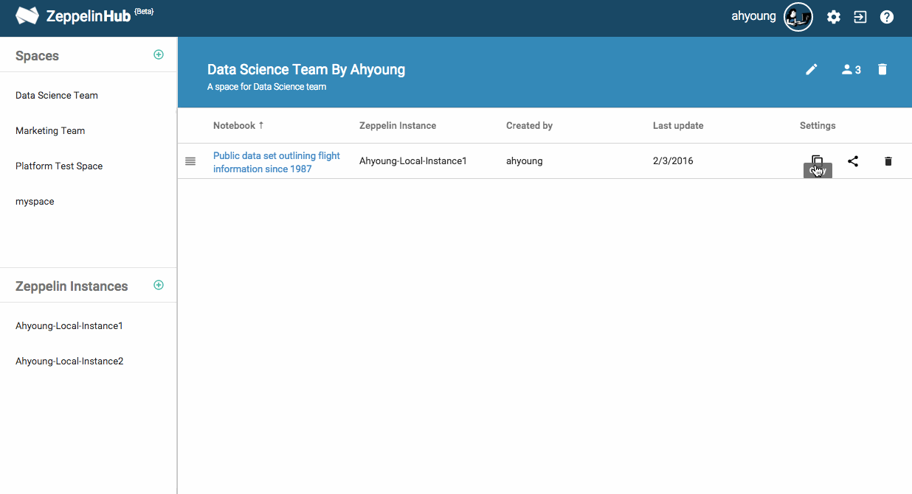

# Copying the notebooks
Sometimes, you might want to have the shared notebooks in your own Zeppelin instances since you need to modify or just run them. If so, copy the notebooks located in the Spaces to your own Zeppelin instances. It can be done also between other Zeppelin instances. 

It's very straightforward. Click a **Copy Button** and select a Zeppelin instance what you want. 

You can also copy the notebook on the fly when you look into other team member's notebook.

