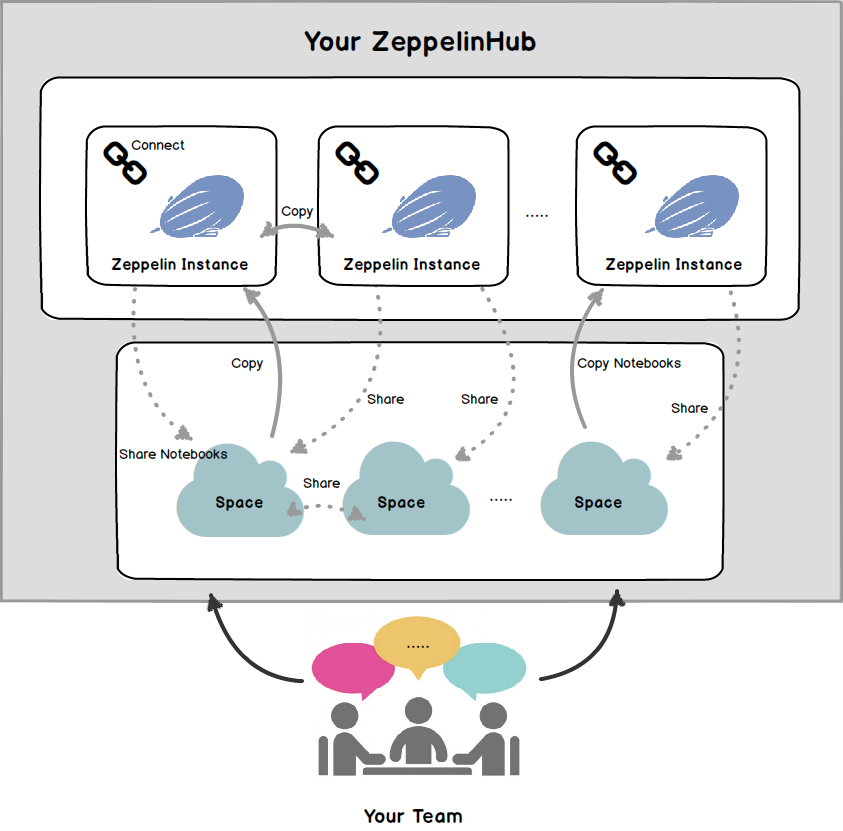

# Overview

Welcome to ZeppelinHub! 

ZeppelinHub enables you to share your Zeppelin notebooks. Once you register and integrate Zeppelin with ZeppelinHub, you can privately share your notebooks and communicate via the notebooks with your team members. The following illustration shows a basic concept of ZeppelinHub.

# Key Concepts
For trully using ZeppelinHub service, there are some componets and processes needed to understand. 

### Your ZeppelinHub Account 
It is pretty straightforward to join ZeppelinHub. When you create an account, you will be asked for your **Registration Code**. Since it is not a unique code for only one person, you can share this code within your organization and invite people. More detailed information is in [Managing your ZeppelinHub Account](zeppelinhub_account.md) section.

### Zeppelin Instance  
You might wonder how you can install and configure Zeppelin. If so, please read [Zeppelin Installation](http://zeppelin.incubator.apache.org/docs/latest/install/install.html) first. As you can see in the above illustrartion, you can manage several **Zeppelin instances** in your ZeppelinHub account. ( **Instance** is not a strange word. It is just a unit of Zeppelin. ) Once you add a new instance in Hub, it will generate a **Unique Token** only for that Zeppelin instance. This token is used to integrate your Zeppelin instance with ZeppelinHub. More specific explanation is in [Zeppelin integration with ZeppelinHub](zeppelin_integration.md).

### Space  
ZeppelinHub **Space** is a unit of sharing notebooks. Using space, you can gather your own and shared notebooks from your team members efficiently. When you create a space, you can invite your team members having a same **Registration Code**. Only invited people have an access permission to the shared notebooks.
For the further details, please refer to [Sharing your Notebooks](sharing_notebooks.md).

 

