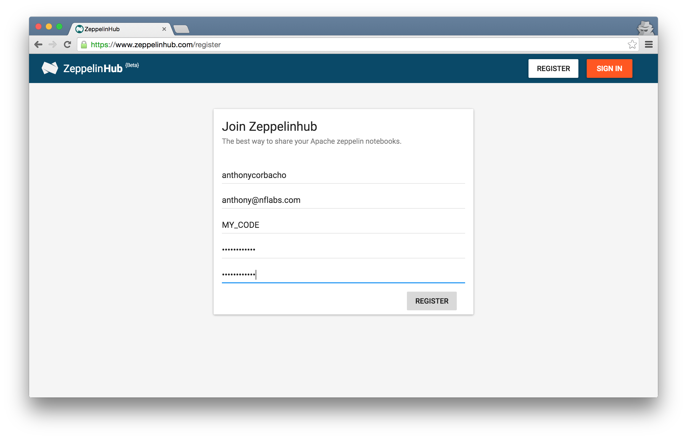

# Managing your Zeppelinhub Account
Congratulations! You have been invited to join ZeppelinHub’s private beta program. This page will help set up you and your organization to try ZeppelinHub.

## Create your ZeppelinHub Account
Create your account and add your registration code.

 * **Login**: Select your username. It should have no spaces or special characters. Alphanumeric only.
 * **Email**: Input your email address. This will be used to send notifications from ZeppelinHub.
 * **Code**: From the email you received, enter the invitation code.

## Manage your Account

## Invite others members to try ZeppelinHub
You can share the `registration code` within your organization to invite people to join and try ZeppelinHub.

## Let's get Started !
Congratulations! You are done with the registration process. You can now Login and start enjoying ZeppelinHub!
