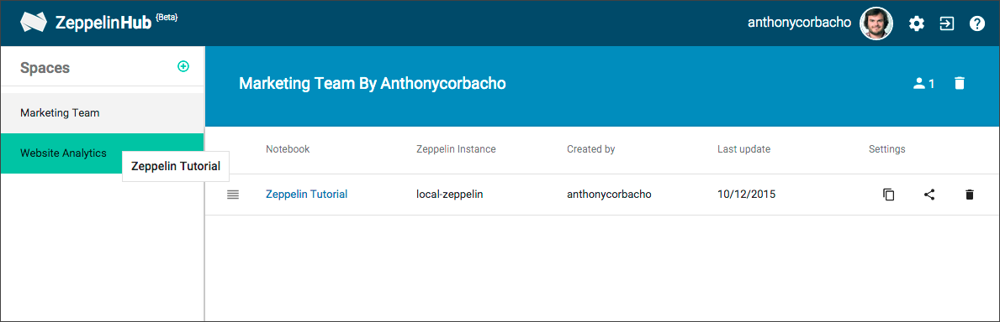

# Sharing your notebooks

In order to share your notebooks with people, you will have to use spaces.

 
## Spaces

You can see your spaces and spaces you are part of on the Side Menu.

A Space allows you to gather both **Notebooks** and **Users**. Making it a perfect place to share your new notebooks with your coworkers.

 
## Creating a Space

You can create a new space by clicking on the **+** button in the Side Menu.

You then, only have to specify a name to see it being created.

 
## Adding Notebooks to a Space

There are multiple ways to add a Notebook to a Space.

__Drag and Drop__

You can drag and drop a notebook into a space or instance.

__Action Button__

You can also click the notebook's share icon.

 
## Inviting Users to your Space

You can manage the members of your space by clicking on the  icon.

