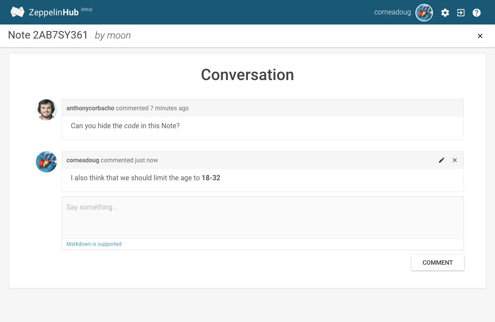

Sharing your Notebooks

You can privately and publically publish your Zeppelin notebook results to anyone you want to share using ZeppelinHub. As soon as you make any changes in Zeppelin, it will be reflected to ZeppelinHub immediately. In this section, we will explain **how to create a space** and **how you can share Zeppelin notebooks and communicate with your team members**.

## What is Space?
ZeppelinHub Space is a unit of sharing notebooks. Using space, you can efficiently gather your own and shared notebooks from your team members. When you create a space, you can invite your people. As a result, you can gather both **Notebooks** and **Users** in the Space. Make it a perfect place to share your new notebooks with your coworkers !

## Creating a Space
Let's create a space.

Click **plus button**, then type your space name and a short description. 

Then you can see your space list at the **Spaces** section in the dashboard.

You can identify the notebook information in the Space such as **the origin Zeppelin instance name of this notebook**, **the notebook creator name** and **the date of last update**. 

## Adding Notebooks to the Space
There are two ways for publishing a notebook from your Zeppelin instance to the Space.

1. Just **Drag and Drop** your notebook to the space name in the dashboard.
	
	
	<br/ >

2. Click **share button**  and select a space.
	

## Inviting your team members to the Space
In the space, you can grant an access permission to your members. Once someone is added to your space, he (or maybe she) can see your space in his ZeppelinHub dashboard.

You can also give some feedbacks about the shared notebooks. Click **conversation button** at the top of the notebook and start a conversation with your people about the report.

