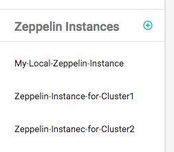

<font class="header-font">Zeppelin integration with ZeppelinHub</font>

In this section, we will explain how you could seamlessly connect your Zeppelin instance to your ZeppelinHub account. 

## Download integration library

First of all, you need a library for integration. Please click this [download link](https://s3-ap-northeast-1.amazonaws.com/zeppel.in/zeppelinhub-integration-v0.3.2-all.jar).

Then copy your library into `lib` directory under your ZEPPELIN_HOME ( Zeppelin installation directory ). If you don't have `lib` folder, just create a new one.

## Add a new Zeppelin Instance and Generate a Token
You need to register for ZeppelinHub account to obtain a Token. If you don't have ZeppelinHub account yet, please read [Managing your ZeppelinHub Account](zeppelinhub_account.md) and sign up first. After login, you can add **a new Zeppelin Instance**.


Click the **plus button** and type a descriptive name for your new instance.


Then, ZeppelinHub will create **a Unique Token** for you.


After then, you can see your instance list at **Zeppelin Instances** section in the dashboard.



After adding a new instance, you can manage your instances at **Manage Instances** tab in the **Setting** page ( click a **gear button** at the top ). In this page, you can edit your instances name or delete the instances from the list. 

But, be carefull. When deleting an Zeppelin instance in the list, it means that you no longer want to syncronize that Zeppelin instance with ZeppelinHub. So it will also remove all notebooks related to this instance from ZeppelinHub.


As you can see the above screenshot image, you may also add a new instance using **Orange Circle Button**.

## Setting Zeppelin environment variables

When you connect a Zeppelin instance to your ZeppelinHub account, you need to set the following **environment variables** into your `ZEPPELIN_HOME/conf/zeppelin-env.sh` file. If you don't have this file, you can create it from `ZEPPELIN_HOME/conf/zeppelin-env.sh.template`. 

```
cd ZEPPELIN_HOME/conf

cp zeppelin-env.sh.template zeppelin-env.sh
```

After activating this configuration file,  add below three lines to `zeppelin-env.sh` file. Don't forget to copy your **Token** generated before.

```
export ZEPPELIN_NOTEBOOK_STORAGE="org.apache.zeppelin.notebook.repo.VFSNotebookRepo, com.nflabs.zeppelinhub.notebook.repo.ZeppelinHubRepo"
export ZEPPELINHUB_API_ADDRESS="https://www.zeppelinhub.com"
export ZEPPELINHUB_API_TOKEN="YOUR_TOKEN_STRING"
```

Now, start ( or restart ) Zeppelin. 

```
./bin/zeppelin-daemon.sh start (or restart)
```


