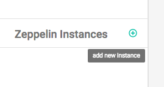
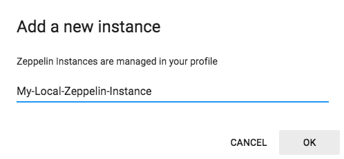
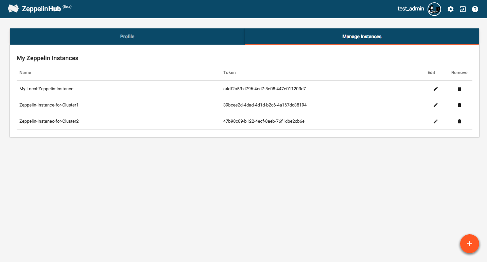

# Zeppelin integration with ZeppelinHub

In this section, we will guide you how you could seamlessly connect your Zeppelin instance to your ZeppelinHub account. 

## Download integration library

First of all, you need a library for integration. Please click this [download link](https://s3-ap-northeast-1.amazonaws.com/zeppel.in/zeppelinhub-integration-v0.3.2-all.jar).

Then copy your library into `lib` directory under your ZEPPELIN_HOME ( Zeppelin installation directory ). If you don't have `lib` folder, just create a new one.

## Add a new Zeppelin Insatnce and Generate a Token
You need to register for a ZeppelinHub account to obtain a Token. If you don't have ZeppelinHub account yet, please read [Managing your ZeppelinHub Account](zeppelinhub_account.md) and sign up first. After login, you can add **a new Zeppelin Instance**.



Click the **plus button** and type a descriptive name for your new instance.



Then, ZeppelinHub will create **a Unique Token** for you.


After that, you can see your instance that you added.


After adding a new instance, you can manage your instances **Manage Instances** tab in the **Setting** page ( click a gear button at the top ). In this page, you can edit your instances name or delete the instances from the list. 

But, be carefull. When deleting an Zeppelin instance in the list, it implies that you no longer want to syncronize that Zeppelin instance with ZeppelinHub. So it will also remove all notebooks related to this instance from ZeppelinHub.



As you can see the above screenshot image, you may also add a new instance using **Orange Circle Button**.

## Setting Zeppelin environment variables

At last, you can connect Zeppelin to your ZeppelinHub account by inserting the following environment variables into your `ZEPPELIN_HOME/conf/zeppelin-env.sh` file. If you don't have this file, create it from `ZEPPELIN_HOME/conf/zeppelin-env.sh.template`. 

```
cd < ZEPPELIN_HOME >/conf/

cp zeppelin-env.sh.template zeppelin-env.sh
```

Then you can activate this configuration file. After that, add below three lines to `zeppelin-env.sh` file. Don't forget to copy your **Token** generated before.

```
export ZEPPELIN_NOTEBOOK_STORAGE="org.apache.zeppelin.notebook.repo.VFSNotebookRepo, com.nflabs.zeppelinhub.notebook.repo.ZeppelinHubRepo"
export ZEPPELINHUB_API_ADDRESS="https://www.zeppelinhub.com"
export ZEPPELINHUB_API_TOKEN="YOUR_TOKEN_STRING"
```

Now you can `start / restart` Zeppelin. 

```
cd < ZEPPELIN_HOME >

./bin/zeppelin-daemon.sh start (or restart)
```


