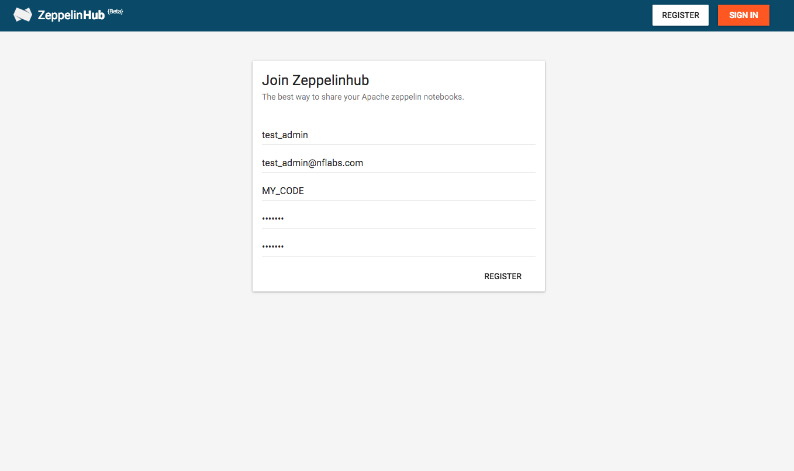
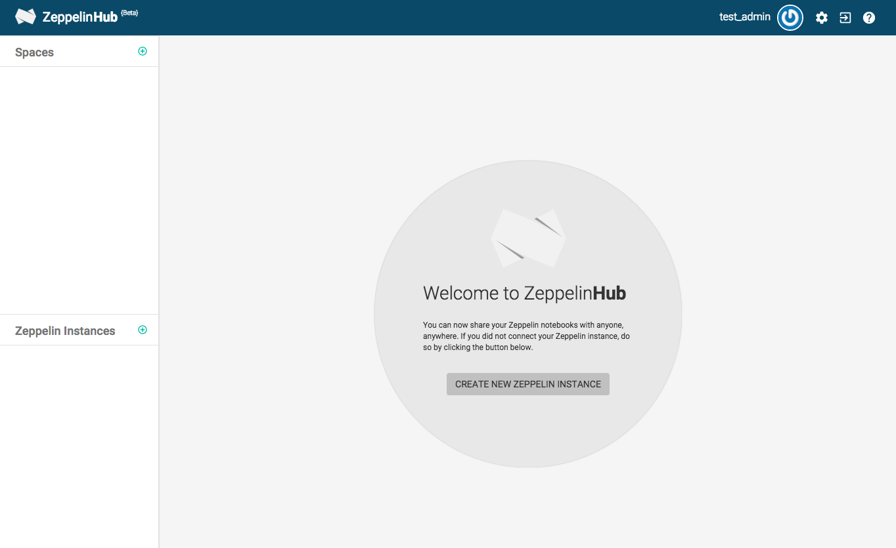

# Managing your ZeppelinHub Account
Welcome your first step to explore ZeppelinHub!
In this section, we will help you to get your foot in the door. 

## Create your ZeppelinHub Account
Since ZeppelinHub is **private** Zeppelin notebook sharing tool, you need your own account. 

As you can see in the above screenshot image, there is nothing special to write down your basic information except **Registration Code**. This unique code is provided to identify your company members. The code can be shared within your organization so that you can invite them to your space. As a result, you can share and communicate only with your people. 

All the process for the registration is done. Welcome to ZeppelinHub!

## Manage your Profile
You can also update your account information after registration. Click a **Gear Button** on top of the page. Then you can manage your private information in the **Profile** tab. 

If you want to upload your profile image, click the image. Then [Gravatar](https://en.gravatar.com/) page will be shown up. 

