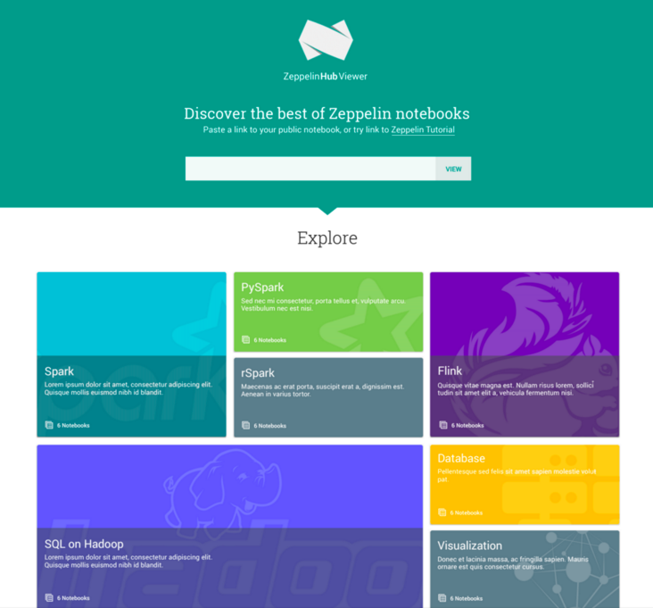
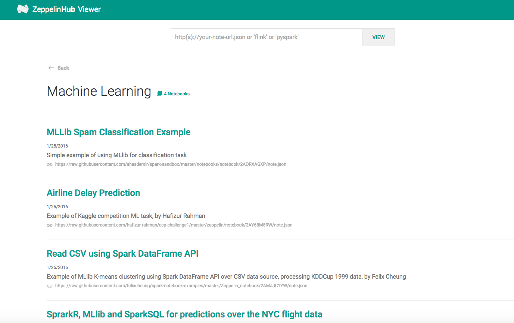

<font class="header">ZeppelinHub Viewer</font>

[ZeppelinHub Viewer](https://www.zeppelinhub.com/viewer) is a community site for sharing Zeppelin notebooks. As long as the notebook is publicly located, you can directly look around it without browsing Zeppelin Homescreen. Using Viewer, you can also explore some dramatic examples.

<center></center>

<br />
<font class="middle">How can you use Viewer ?</font>

You can easily find a text input box in [ZeppelinHub](https://www.zeppelinhub.com) and [ZeppelinHub Viewer](https://www.zeppelinhub.com/viewer) main web page. If you have any public notebook for your own ( or any other public notebook ), copy the `note.json` location and paste it to the input box and click **VIEW** button.

<center></center>

For example, Zeppelin provides a [Zeppelin Tutorial](https://github.com/apache/incubator-zeppelin/blob/master/notebook/2A94M5J1Z/note.json) in [Zeppelin github repository](https://github.com/apache/incubator-zeppelin). 
Here is a link.

```
https://github.com/apache/incubator-zeppelin/blob/master/notebook/2A94M5J1Z/note.json
```

<br />
<font class="middle">Or just explore</font>

We provide some collections in the ZeppelinHub Viewer you may be attracted. Just explore interesting example notebooks.

<center></center>
